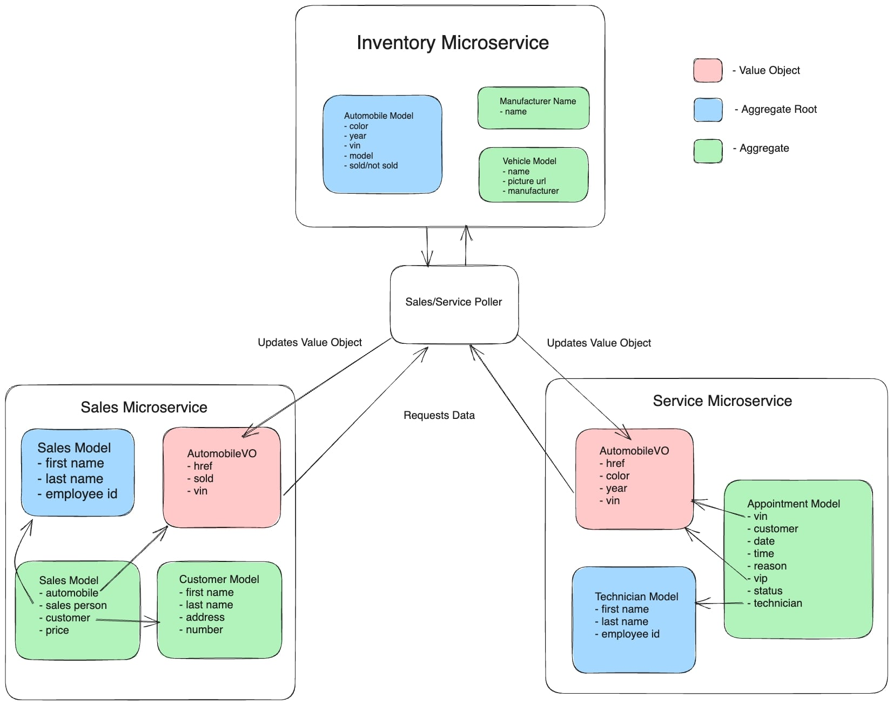

# CarCar

Team:

Justin Huynh - Service  
Jonathan Cornejo - Sales

## Getting Started
1. Fork and clone the project with this command:
`git clone <repo url>`
2. Make sure you're in the right directory
`CD project-beta`
3. Run the following commands to start docker desktop:
`docker volume create beta-data`
`docker-compose build`
`docker-copose up`
4. There should be seven containers with a green status to signify that its running.
5. Open up Chrome(Browser) and go to http://localhost:3000/ in the address bar.

## Design

CarCar is made up of 3 microservices:
- Inventory 
- Service
- Sales



## Inventory Microservice
This microservice is made up of 3 models: Manufacturer, VehicleModel, and Automobiles. The inventory microservice handles the data of all the vehicles being passed through the app.

The Manufacturer model has only one property, name, which holds the data to all manufacturer types available in the inventory.

The VehicleModel model has the properties name, picture_url, and manufacturer. The manufacturer property is a foreign key which references the name of the manufacturer from the Manufacturer model. The name takes the input of a name and picture_url takes the input of a picture url.

The Automobile model has the properties color, vin, year, and model. The other 2 microservices uses a poller to pull data from this model. The model property is a foreign key that refers to the VehicleModel for the name. The color takes the input of a color of the vehicle, the year takes the input of the year of the vehicle, and vin takes the vin number of the vehicle.

**Manufacturer API**
| Action | Method | URL
| ----------- | ----------- | ----------- |
| List of Manufacturers | GET | http://localhost:8100/api/manufacturers/
| Create a Manufacturer | POST | http://localhost:8100/api/manufacturers/
| Details of a Manufacturer | GET | http://localhost:8100/api/manufacturers/:id
| Update a Manufacturer | PUT | http://localhost:8100/api/manufacturers/:id/
| Delete a Manufacturer | DELETE | http://localhost:8100/api/manufacturers/:id/

<details><summary>GET: List of Manufacturers</summary>
Returns:

```
{
  "manufacturers": [
    {
      "href": "/api/manufacturers/1/",
      "id": 1,
      "name": "Daimler-Chrysler"
    }
  ]
} 
```
</details>
<details><summary>POST: Create a Manufacturer</summary>
Returns:

```
{
  "href": "/api/manufacturers/1/",
  "id": 1,
  "name": "Chrysler"
}  
```
</details>
<details><summary>GET: Details of a Manufacturer</summary>
Returns:

```
{
  "href": "/api/manufacturers/1/",
  "id": 1,
  "name": "Chrysler"
}  
```
</details>
<details><summary>PUT: Update a Manufacturer</summary>
Returns:

```
{
  "href": "/api/manufacturers/1/",
  "id": 1,
  "name": "Chrysler"
}  
```
</details>

**VehicleModels API**
| Action | Method | URL
| ----------- | ----------- | ----------- |
| List of Vehicle Models | GET | http://localhost:8100/api/models/
| Create a Vehicle Model | POST | http://localhost:8100/api/models/
| Details of a Vehicle Model | GET | http://localhost:8100/api/models/:id
| Update a Vehicle Model | PUT | http://localhost:8100/api/models/:id/
| Delete a Vehicle Model | DELETE | http://localhost:8100/api/models/:id/

<details><summary>GET: List of Vehicle Models</summary>
Returns:

```
{
  "href": "/api/models/1/",
  "id": 1,
  "name": "Sebring",
  "picture_url": "https://upload.wikimedia.org/wikipedia/commons/thumb/7/71/Chrysler_Sebring_front_20090302.jpg/320px-Chrysler_Sebring_front_20090302.jpg",
  "manufacturer": {
    "href": "/api/manufacturers/1/",
    "id": 1,
    "name": "Daimler-Chrysler"
  }
} 
```
</details>
<details><summary>POST: Create a Vehicle Model</summary>
Returns:

```
{
  "name": "Sebring",
  "picture_url": "https://upload.wikimedia.org/wikipedia/commons/thumb/7/71/Chrysler_Sebring_front_20090302.jpg/320px-Chrysler_Sebring_front_20090302.jpg",
  "manufacturer_id": 1
} 
```
</details>
<details><summary>GET: Details of a Vehicle Model</summary>
Returns:

```
{
  "href": "/api/models/1/",
  "id": 1,
  "name": "Sebring",
  "picture_url": "https://upload.wikimedia.org/wikipedia/commons/thumb/7/71/Chrysler_Sebring_front_20090302.jpg/320px-Chrysler_Sebring_front_20090302.jpg",
  "manufacturer": {
    "href": "/api/manufacturers/1/",
    "id": 1,
    "name": "Daimler-Chrysler"
  }
} 
```
</details>
<details><summary>PUT: Update a Vehicle Model</summary>
Returns:

```
{
    "name": "Sebring",
    "picture_url": "https://upload.wikimedia.org/wikipedia/commons/thumb/7/71/Chrysler_Sebring_front_20090302.jpg/320px-Chrysler_Sebring_front_20090302.jpg"
} 
```
</details>

**Automobiles API**
| Action | Method | URL
| ----------- | ----------- | ----------- |
| List of Automobiles | GET | http://localhost:8100/api/automobiles/
| Create an Automobile | POST | http://localhost:8100/api/automobiles/
| Details of an Automobile | GET | http://localhost:8100/api/automobiles/:vin/
| Update an Automobile | PUT | http://localhost:8100/api/automobiles/:vin/
| Delete an Automobile | DELETE | http://localhost:8100/api/automobiles/:vin/

<details><summary>GET: List of Automobiles</summary>
Returns:

```
{
  "autos": [
    {
      "href": "/api/automobiles/1C3CC5FB2AN120174/",
      "id": 1,
      "color": "yellow",
      "year": 2013,
      "vin": "1C3CC5FB2AN120174",
      "model": {
        "href": "/api/models/1/",
        "id": 1,
        "name": "Sebring",
        "picture_url": "https://upload.wikimedia.org/wikipedia/commons/thumb/7/71/Chrysler_Sebring_front_20090302.jpg/320px-Chrysler_Sebring_front_20090302.jpg",
        "manufacturer": {
          "href": "/api/manufacturers/1/",
          "id": 1,
          "name": "Daimler-Chrysler"
        }
      },
      "sold": false
    }
  ]
} 
```
</details>
<details><summary>POST: Create an Automobile</summary>
Returns:

```
{
  "color": "red",
  "year": 2012,
  "vin": "1C3CC5FB2AN120174",
  "model_id": 1
} 
```
</details>
<details><summary>GET: Details of an Automobile</summary>
Returns:

```
{
  "href": "/api/automobiles/1C3CC5FB2AN120174/",
  "id": 1,
  "color": "yellow",
  "year": 2013,
  "vin": "1C3CC5FB2AN120174",
  "model": {
    "href": "/api/models/1/",
    "id": 1,
    "name": "Sebring",
    "picture_url": "https://upload.wikimedia.org/wikipedia/commons/thumb/7/71/Chrysler_Sebring_front_20090302.jpg/320px-Chrysler_Sebring_front_20090302.jpg",
    "manufacturer": {
      "href": "/api/manufacturers/1/",
      "id": 1,
      "name": "Daimler-Chrysler"
    }
  },
  "sold": false
} 
```
</details>
<details><summary>PUT: Update an Automobile</summary>
Returns:

```
{
  "color": "red",
  "year": 2012,
  "sold": true
} 
```
</details>

## Service Microservice
The service is made up of 3 services: AutomobileVO, Technician, and Appointment.

The AutomobileVO model has these properties: vin, sold, and import_href. This model represents the Automobile model in the inventory microservice, which polls the data to update or create the value object to use.

The Technician model has these properties: name and employee_number. This model creates and stores data related to the technician.

The Appointment model has these properties: vin, customer_name, date, reason, status, vip, and technician. This model is used to create and store data for all appointments made. The date, reason, and customer_name is used to fill out basic information. The vin is used to keep track of the specific automobile vin number, which goes hand in hand with the vip property so we know if that customre gets vip treatment. The technician is a foreign key so that when an appointment is made, a designated technician employee is assigned to that customer. 

This service is going to broken down into different API endpoints (url for web addresses) for service as well as the format for sending data to each componenet.
- Technicians
- Appointments

**Technicians API**
| Action | Method | URL
| ----------- | ----------- | ----------- |
| List Technicians | GET | http://localhost:8080/api/technicians/
| Create a Technician | POST | http://localhost:8080/api/technicians/
| Delete a Technician | DELETE | http://localhost:8080/api/technicians/:id/

<details><summary>GET: List of Technicians</summary>
Returns:

```
{
    "href": "/api/technicians/5/",
    "name": "asdf",
    "employee_number": 5,
    "id": 5
}
```
</details>
<details><summary>POST: Creating a New Technician</summary>
Returns:

```
{
    "href": "/api/technicians/5/",
    "name": "asdf",
    "employee_number": 5,
    "id": 5
}
```
</details>
<details><summary>DELETE: Deleting a Technician</summary>
Returns:

```
{
    "deleted": true
}
```
</details>

**Appointments API**
| Action | Method | URL
| ----------- | ----------- | ----------- |
| List Appointments | GET | http://localhost:8080/api/appointments/
| Create an Appointment | POST | http://localhost:8080/api/appointments/
| Delete an Appointment | DELETE | http://localhost:8080/api/appointments/:id/
| Set an Appointment to canceled | PUT | http://localhost:8080/api/appointments/:id/cancel
| Set an Appointment to finished | PUT | http://localhost:8080/api/appointments/:id/finish

<details><summary>GET: List of Appointments</summary>
Returns:

```
{
    "href": "/api/appointments/5/",
    "vin": "5",
    "customer_name": "mike",
    "date": null,
    "reason": "",
    "vip": false,
    "technician": {
        "href": "/api/technicians/3/",
        "name": "mike",
        "employee_number": 3,
        "id": 3
    },
    "status": "Cancelled",
    "id": 5,
    "is_vip": false
}
```
</details>
<details><summary>POST: Creating a New Appointment</summary>
Returns:

```
{
    "href": "/api/appointments/7/",
    "vin": 7,
    "customer_name": "asdf",
    "date": null,
    "reason": "",
    "vip": false,
    "technician": {
        "href": "/api/technicians/3/",
        "name": "mike",
        "employee_number": 3,
        "id": 3
    },
    "status": "Pending",
    "id": 7,
    "is_vip": false
}
```
</details>
<details><summary>DELETE: Deleting an Appointment</summary>
Returns:

```
{
    "deleted": true
}
```
</details>
<details><summary>PUT: Set Appointment Status to Canceled</summary>
Returns:

```
{
	"href": "/api/appointments/1/",
	"vin": "1",
	"customer_name": "test",
	"date": null,
	"reason": "",
	"vip": false,
	"technician": {
		"href": "/api/technicians/1/",
		"name": "justin",
		"employee_number": 1,
		"id": 1
	},
	"status": "Cancelled",
	"id": 1,
	"is_vip": false
}
```
</details>
<details><summary>PUT: Set Appointment Status to Finished</summary>
Returns:

```
{
	"href": "/api/appointments/1/",
	"vin": "1",
	"customer_name": "test",
	"date": null,
	"reason": "",
	"vip": false,
	"technician": {
		"href": "/api/technicians/1/",
		"name": "justin",
		"employee_number": 1,
		"id": 1
	},
	"status": "Finished",
	"id": 1,
	"is_vip": false
}
```
</details>

## Sales microservice

In the sales microservice, I created 4 models which include AutomobileVO, Customer, Salesperson, and Sales record. These models were necessary so that they interact with our other microservices in our application. For example, the AutomobileVO was required so that my poller function can fetch data from the inventory microservice and create a copy of the Automobile essentially. The sales record encapsulates all the other three components in my sales microservices and interacts with them so I accounted for this in my api_sales views. A sales record was created by having the salesperson, customer, and automobileVO. I added encoders accordingly in order to add those to my views and send a json response to the server. 

The front end then fetches this data through a fetch request at specific endpoints in our application in order to pass down state to our other components in React. Additionally, the manufacturer had to be first created in our back end so that we can create a vehicle model and finally an automobile in our inventory microservice. This information was then displayed in our front end through the usage of forms and displaying the information in lists or tables while updating the state and passing down props from parent component to child components.

**Salespeople API**
| Action | Method | URL
| ----------- | ----------- | ----------- |
| List Salespeople | GET | http://localhost:8090/api/salespeople/
| Create a Salesperson | POST | http://localhost:8090/api/salespeople/
| Delete a Salesperson | DELETE | http://localhost:8090/api/salespeople/:id/

<details><summary>GET: List of Salespeople</summary>
Returns:

```
{
  "first_name": "den",
  "last_name": "lopez",
  "employee_id": "3",
  "id": 1
}
```
</details>
<details><summary>POST: Create a Salesperson</summary>
Returns:

```
{
    "first_name": "Lewis",
    "last_name": "May",
    "employee_id": "5",
    "id": 3
}
```
</details>
<details><summary>DELETE: Delete a Salesperson</summary>
Returns:

```
{
  "message": "Does not exist"
}
```
</details>

**Customers API**
| Action | Method | URL
| ----------- | ----------- | ----------- |
| List Customers | GET | http://localhost:8090/api/customers/
| Create a Customer | POST | http://localhost:8090/api/customers/
| Delete a Customer | DELETE | http://localhost:8090/api/customers/:id/

<details><summary>GET: List of Customers</summary>
Returns:

```
{
  "first_name": "Jin",
  "last_name": "Smith",
  "address": "5099 Mouse Dr. Milpitas, CA",
  "phone_number": "(610)432-3499",
  "id": 3
}
```
</details>
<details><summary>POST: Create a Customer</summary>
Returns:

```
{
  "first_name": "Luis",
  "last_name": "Kling",
  "address": "2099 Steam Dr. Milpitas, CA",
  "phone_number": "(290)431-3359",
  "id": 5
}
```
</details>
<details><summary>DELETE: Delete a Customer</summary>
Returns:

```
{
  "message": "Does not exist"
}
```
</details>

**Sales API**
| Action | Method | URL
| ----------- | ----------- | ----------- |
| List Sales | GET | http://localhost:8090/api/sales/
| Create a Sale | POST | http://localhost:8090/api/sales/
| Delete a Sale | DELETE | http://localhost:8090/api/sales/:id/

<details><summary>GET: List of Sales</summary>
Returns:

```
{
  "automobile": {
      "vin": "ERUC297CJ29983882",
      "sold": true,
      "id": 1
  },
  "salesperson": {
      "first_name": "den",
      "last_name": "lopez",
      "employee_id": "3",
      "id": 1
  },
  "customer": {
      "first_name": "Jin",
      "last_name": "Smith",
      "address": "5099 Mouse Dr. Milpitas, CA",
      "phone_number": "(610)432-3499",
      "id": 3
  },
  "price": 14000,
  "id": 4
}
```
</details>
<details><summary>POST: Create a Sale</summary>
Returns:

```
{
  "automobile": {
      "vin": "ERUC297CJ29983882",
      "sold": true,
      "id": 1
  },
  "salesperson": {
      "first_name": "den",
      "last_name": "lopez",
      "employee_id": "3",
      "id": 1
  },
  "customer": {
      "first_name": "Jin",
      "last_name": "Smith",
      "address": "5099 Mouse Dr. Milpitas, CA",
      "phone_number": "(610)432-3499",
      "id": 3
  },
  "price": 14000,
  "id": 4
}
```
</details>
<details><summary>DELETE: Delete a Sale</summary>
Returns:

```
{
  "message": "Does not exist"
}
```
</details>
